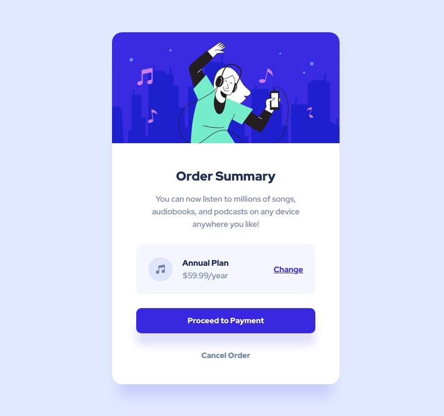

# Frontend Mentor - Order summary card solution

This is a solution to the [Order summary card challenge on Frontend Mentor](https://www.frontendmentor.io/challenges/order-summary-component-QlPmajDUj). Frontend Mentor challenges help you improve your coding skills by building realistic projects.

## Table of contents

- [Overview](#overview)
  - [The challenge](#the-challenge)
  - [Screenshot](#screenshot)
  - [Links](#links)
- [My process](#my-process)
  - [Built with](#built-with)
  - [What I learned](#what-i-learned)
  - [Continued development](#continued-development)
  - [Useful resources](#useful-resources)
- [Author](#author)
- [Acknowledgments](#acknowledgments)

## Overview

### The challenge

Users should be able to:

- See hover states for interactive elements

### Screenshot

 

### Links

- Solution URL: [Github](https://github.com/marisudris/frontend-mentor-order-component)
- Live Site URL: [Github Pages](https://marisudris.github.io/frontend-mentor-order-component/)

## My process

I basically used a top-down/outside-in approach, starting with containing
card element, working inwards, and from top to bottom. Details like shadows,
text color, hover styles & transitions came after finishing layouts. After
that came the painstaking detail adjustment and fine-tuning.

### Built with

- CSS custom properties
- BEM naming convention
- Flexbox
- Mobile-first workflow (for the most part, sometimes switching to desktop view
  a bit early to hash out some details)

### What I learned

Project time estimation is tricky, and the closer I got to finishing the task - the
longer it seemed to take. I felt a strong desire for pixel-perfect(ish)
implementation, however, as the warnings against it say - it's a hard and pretty much
unnecessary task. The best way to go is to try to extrapolate the *intent*
behind certain styles (like spacing before & after an element - are they equal,
or do they seem to differ?) and implement them with adjustments, if necessary.

As for spacing between various card elements - I decided to go with the
*lobotomized owl* selector and let the parent card control the spacing (via
margins) between its child elements:

```css
.card__body > * + * {
  margin-top: 1.75em
}
```
However - the pure copy text inside the card (which I enclosed in
*.card__copy* class) felt vertically misaligned with bigger than normal
spacing relative to its sibling elements - the reason seems to be the
extra line-height making the line boxes bigger and adding more visual space above 
and below the text (the size of half the computed line height) in addition to margin.
Since the text itself is not enclosed in a border box and doesn't have its own
background color - the spacing and vertical rhythm measurements start from the text itself.

The vertical spacing introduced by the extra line-height (which also could've been padding) visually *merges* with the margin. For this reason I decided to override its margin to make it slightly smaller, while setting its line-height to be larger & according to the design:

```css
.card__copy {
  line-height: 1.6;
  margin: 1em 0;
}
```

### Continued development

Going forward I plan to focus on turning a design into a properly
structured and accessible HTML - particularly when it's not 100% clear how to do
it or when there are multiple options on how to accomplish this and give some
good styling hooks for coding CSS. One particular issue here I ran into was the
button-vs-link choice. It prompted me to do some research and there seems to be
a growing consensus on the idea of [material honesty](https://medium.com/simple-human/but-sometimes-links-look-like-buttons-and-buttons-look-like-links-9b371c57b3d2).
According to it - links should *look* like links and buttons should *look* like buttons. So in
this particular project I tried to do just that - even though there are some
gray areas - the *Cancel* button may very well be a link, however I chose to
interpret it as a button which could just clear the items without navigating
the user away from the page and given that it looks like it's vertically grouped together with the *call-to-action* button. The purple *call-to-action* button could be a link
(if it navigates the user to a new checkout page or similar), however, since it *looks* like
a button in the design, I chose to mark it up as a button. The choice could be
affected by the knowledge of how the page/app behaves in this particular
scenario and use case in a real world project.  
Aside from all things I mentioned, I'm looking forward to learning efficient
CSS rule application - sometimes I felt like I'm *overengineering* some
solutions (an issue that can be exacerbated by chasing pixel-perfection).
I tried to adhere to a *single source of truth* rule of programming, hence
I used CSS variables where I could, used the BEM naming convention to make it more
modular and keep the specificity more streamlined and coherent - even though 
this is a relatively small project and the benefits of BEM or other types of
conventions are less beneficial here.

### Useful resources

- [Modern CSS](https://moderncss.dev/) - full of modern CSS solution ideas. In this particular instance I borrowed some [button styling](https://moderncss.dev/css-button-styling-guide/) ideas, with using inline-flex, centering and then freely setting min-heights.
- [Every Layout](https://every-layout.dev/) - by [Heydon Pickering](https://twitter.com/heydonworks) & [Andy Bell](https://twitter.com/piccalilli_). This is quite an amazing resource for learning systematic layout design and learning how a particular layout can be implemented. This is a resource I'll probably use and refer to in every front-end project. I used the [Stack](https://every-layout.dev/layouts/stack/) layout here and borrowed the *lobotomized owl* selector idea from here (I chose to use the default block layout event though flex column could've worked too).

## Author

- GitHib - [Maris Ūdris](https://github.com/marisudris)
- Frontend Mentor - [@harlequiin](https://www.frontendmentor.io/profile/harlequiin)

